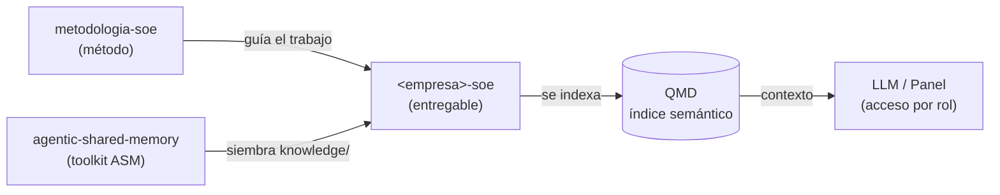

# Arquitectura de repositorios

Qué repositorio es cada cosa, qué rol cumple y cómo se conectan. Resuelve la
pregunta "¿dónde vive cada cosa y cómo se usa?".

## Los tres niveles

```text
NIVEL 1 — MÉTODO (IP del asesor)
  repo: metodologia-soe
  → el qué y el cómo: definición, filosofía, servicio, proceso, plantillas.
  → NO es el SOE de ninguna empresa.

NIVEL 2 — TOOLKIT (componente reutilizable)
  repo: agentic-shared-memory
  → el estándar ASM: patrón + template (knowledge/) + skills (qmd, bootstrap).
  → instalable y copiable; se reutiliza en cada cliente.

NIVEL 3 — INSTANCIA (entregable por cliente)
  repo: <empresa>-soe
  → el SOE real de una empresa. Lo que le queda.
  → su núcleo knowledge/ es una instancia del template ASM.
```

## Cómo se conectan



- El **método** (Nivel 1) dice cómo trabajar; no se copia al cliente.
- El **toolkit ASM** (Nivel 2) aporta la estructura `knowledge/` y las skills; se
  usa para sembrar y mantener la parte de conocimiento del entregable.
- El **entregable** (Nivel 3) es lo único que vive en el repo del cliente.

## Rol de cada repo

| Repo | Rol | De quién es | Cambia por cliente |
| --- | --- | --- | --- |
| `metodologia-soe` | Método / IP | Asesor | No |
| `agentic-shared-memory` | Toolkit de conocimiento (ASM) | Asesor | No |
| `<empresa>-soe` | Entregable / SOE real | Empresa | Sí |

## Dónde encaja QMD (indexación)

QMD es el motor de índice semántico local. **Indexa la carpeta `knowledge/` del
`<empresa>-soe`** y permite que un LLM responda con contexto real del negocio.

```text
<empresa>-soe/knowledge/  (Markdown + Git)
   -> qmd --index <empresa>-soe collection add docs ./knowledge/
   -> índice semántico local
   -> LLM / panel (cada usuario ve lo que su rol permite)
```

El flujo de sincronización posible (ver también
[implementación técnica](./implementacion-tecnica.md)):

```text
Repo Git -> VPS (clona/pull) -> QMD (indexa) -> LLM -> Panel web
```

## Convención de nombres

- Repo del método: `metodologia-soe` (único).
- Repo del toolkit: `agentic-shared-memory` (único).
- Repo por cliente: `<empresa>-soe` (ej. `acme-soe`), con ASM en `knowledge/`.

## Separación de responsabilidades

- El **toolkit ASM se ocupa solo de `knowledge/`.** No conoce el resto de las
  capas del SOE (`model/`, `systems/`, `automations/`, `governance/`).
- El **scaffold completo de `<empresa>-soe`** es responsabilidad de la metodología
  (ver [entregable](./entregable-soe.md)), automatizado por el skill
  [soe-bootstrap](../skills/soe-bootstrap/SKILL.md).
